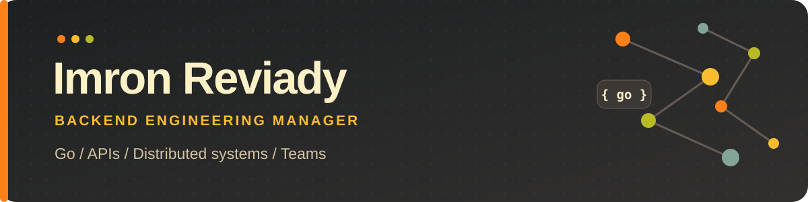

  

  
  
  

<table>
  <tr>
    <td width="34%" align="center" valign="middle">
      
    </td>
    <td width="66%" valign="middle">
      <h3>Hi, I'm Imron 👋</h3>
      
I lead backend teams and stay close to the code. I work on API design, scalable systems, and turning product requirements into reliable software.

      
<strong>Backend:</strong> Go, Python, Laravel, Node.js <strong>Data:</strong> PostgreSQL, MySQL, MongoDB, Redis <strong>Infrastructure:</strong> Docker, AWS, GCP

      

    </td>
  </tr>
</table>

### Tools I work with

  
  
  
  
  
  
  

### GitHub activity

  
  
  

### Achievements

  

  
  
  

